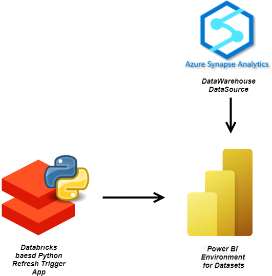

# Automated Dataset Sync in Power BI using Azure Databricks

# Introduction
This application is responsible for triggering dataset refreshes in Power BI given the workspace name in which the dataset resides and the desired dataset name which needs to be refreshed. The need for such an application arises when a dataset in Power BI linked through import mode to an external data source mainly data warehouses such as Azure Synapse or SQL Server pulls data physically into Power BI. Now, when the data in the data source increments due to an incremental load, the linked dataset in Power BI does not contain the latest version of the data. In order to keep the dataset's data in sync with the data source version of data, a manual refresh is required. However, in production this needs to be automated and that is what this application does

# Design and Implementation
In order to automate the dataset refreshes, there arises a need to invoke the Power BI Rest Api. However, in order to do that from our databricks python environment there is a requirement for authentication mechanism. As this application is a part of the production therefore we cannot rely on username and password of a specific user and hence need a service principal for that very purpose. In a nutshell these are the steps in the authentication pathway for Power BI
1) Create a service principal having the following Power BI Service Api Permissions  
    *Dataset.ReadWrite.All* 
    *Workspace.Read.All*
2) Create a security group which should contain the service principal created before as a member to it
3) Moving forward, add the security group containing the service principal created in the first step  
to allow service principal to use Power BI APIs via the developer settings in the tenant settings through the Admin Portal
4) Add the security group to the workspace which contains the desired dataset
5) Finally, Attach the service principal to databricks workspace as a contributor

Once, the authentication preliminaries are setup `ClientSecretCredential()` function from `azure.identity` is used to get the access token by providing the *client_id*, *client_secret* and *tenant_id* of the service principal. Following this `refresh_dataset` function takes the access token with the workspace name and the dataset name and refreshes the desired dataset.
To meet the production standards exception handling and logging is also implemented. Given below is a diagram of the entire architecture for better visual understanding 

  

